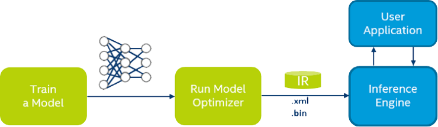

This document introduces the development, coding tools, coding libraries for Intel OpenVINO EdgeAI.
---
# Coding platform
> **Local coding**
>> Hardware: https://software.intel.com/en-us/openvino-toolkit/hardware  
>> Software OpenVINO: https://software.intel.com/en-us/openvino-toolkit
>>> Document: https://docs.openvinotoolkit.org/latest/index.html  
>>> Toolkit: https://github.com/opencv/dldt Designed to accelerate the development of applications and solutions that emulate human vision. Based on (CNN), the toolkit extends workloads across Intel hardware (including accelerators) and maximizes performance.

> **Cloud coding** No hardware setup required on your end. The DevCloud utilizes Jupyter* Notebooks to execute code directly within the Web browser. https://devcloud.intel.com/edge/home  
  
  
Modles->Optimizer->IR->Inference Engine-> Extracting Results ->Edge deployment    
# Deep learning networks
*	SSD
*	YOLO
*	Faster RCNN
*	MobileNet
*	ResNet
*	Inception
  
# Deep learning models
1. We need DL models to fetch into OpenVINO inference engine. Using a tool, such as Caffe, to create and train a CNN inference model or directly use the pretrained models from below link.  
https://software.intel.com/en-us/openvino-toolkit/documentation/pretrained-models  
https://github.com/opencv/open_model_zoo  
2. In oder to fetch the model into IE, we need adjust or resize the input data per model’s requirement and what library you use to load an image or frame, the requirement can be checked from model reference webpage or from OpenVINO Toolkit documentation.  
> Example of processing INPUT AND OUTPUT SHAPE  
For the model ‘human-pose-estimation-0001’ https://docs.openvinotoolkit.org/latest/_models_intel_human_pose_estimation_0001_description_human_pose_estimation_0001.html, we can get the output are two blobs with shapes: [1, 38, 32, 57] and [1, 19, 32, 57]. The first blob contains keypoint pairwise relations (part affinity fields), the second one contains keypoint heatmaps. Then what is the exactly mean for every dimension data on [1, 38, 32, 57] and and [1, 19, 32, 57]?    

> The model 'human-pose-estimation-0001’ is 
> * a multi-person 2D pose estimation network (based on the OpenPose approach) https://arxiv.org/pdf/1611.08050.pdf 
> * with tuned MobileNet v1 as a feature extractor https://arxiv.org/pdf/1704.04861.pdf
> * The pose may contain up to 18 keypoints: ears, eyes, nose, neck, shoulders, elbows, wrists, hips, knees and ankles
> * Source framework is caffe http://caffe.berkeleyvision.org/tutorial/net_layer_blob.html

> The conventional blob dimensions for batches of image data are number N x channel K x height H x width W. Blob memory is row-major in layout, so the last / rightmost dimension changes fastest. For example, in a 4D blob, the value at index (n, k, h, w) is physically located at index ((n * K + k) * H + h) * W + w.
> * Number / N is the batch size of the data. Batch processing achieves better throughput for communication and device processing. For an ImageNet training batch of 256 images N = 256.
> * Channel / K is the feature dimension e.g. for RGB images K = 3.  

> ‘human-pose-estimation-0001.xml’ showed the input dimensions on top of its reference webpage, and the ‘Mconv7_stage2_L2’ output dimensions at bottom of that page. Both have the same format [BxCxHxW]  

> It shows as below picture.  
> 

# Model optimizer
https://docs.openvinotoolkit.org/latest/_docs_MO_DG_Deep_Learning_Model_Optimizer_DevGuide.html  

If a model is not one of the pre-converted models in the Pre-Trained Models OpenVINO provides, we required the step of model optimizer to move onto the Inference Engine.  
Assumes you have a network model trained using a supported deep learning framework.  
Supported frameworks by OpenVINO Toolkit
* https://caffe.berkeleyvision.org/ UC Berkeley
* https://www.tensorflow.org/ Google Brain
* https://mxnet.apache.org/  Apache Software
* https://onnx.ai/  which can support PyTorch and Apple ML models through another conversion step. combined effort of Facebook and Microsoft
* https://kaldi-asr.org/doc/dnn.html originally an individual’s effort, primarily focused on speech recognition data

# Coding library examples
1. Some notes for pre-process of model input data by openCV2:
* cv2.imread will load the image with BGR channel (matlab is RGB sequence) 
*	cv2.resize  the image size to fit in model requirement 
*	The image is actually descripted as a matrix. For OpenCV of Python，image is the NumPy array, can be changed by .transpose and .reshape method/function   
2. We use python command with special parameters for model optimization, please refer for detailed information against supported frameworks and the document of model optimizer
3. To load an IR into the Inference Engine, we mostly work with two classes IECore and IENetwork in the openvino.inference_engine library (if using Python https://docs.openvinotoolkit.org/latest/ie_python_api.html):
> IECore, which is the Python wrapper to work with the Inference Engine
>> * In the IECore documentation, no arguments are needed to initialize.
>> * query_network, which takes in an IENetwork as an argument and a device name, and returns a list of layers the Inference Engine supports. You can then iterate through the layers in the IENetwork you created, and check whether they are in the supported layers list. If a layer was not supported, a CPU extension may be able to help.
>> * The device_name argument is just a string for which device is being used - ”CPU”, ”GPU”, ”FPGA”, or ”MYRIAD” (which applies for the Neural Compute Stick).  

> IENetwork, which is what will initially hold the network and get loaded into IECore
To use IENetwork, you need to load arguments named model and weights to initialize - the XML and Binary files that make up the model’s Intermediate Representation.  
4. Flask is A Python framework useful for web development and another potential option for video streaming to a web browser. https://www.fullstackpython.com/flask.html  
5. OpenCV is an open-source library for various image processing and computer vision techniques that runs on a highly optimized C++ back-end, available for use with Python and Java as well  
6. MQTT is a lightweight pub/sub architecture communication for resource constrined devices, communication etc. ROS also has this pub/sub service.  
> https://software.intel.com/en-us/SetupGateway-MQTT Python library for working with MQTT called paho-mqtt 
> https://pypi.org/project/paho-mqtt/ sub-library client, which is how you create an MQTT client that can publish or subscribe to the broker  

7. we can use  FFmpeg library to transform video to server if necessary
8. Node.js can be used for user front interface to show MQTT or FFmpeg data

