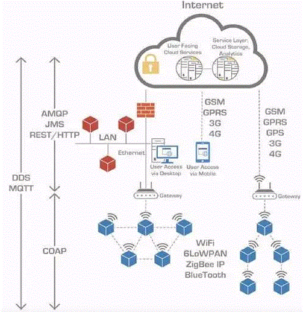

  

通信对物联网来说十分常用且关键，在物联网协议中，我们一般分为两大类。
* 传输协议: 一般负责子网内设备间的组网及通信；
* 通信协议: 主要是运行在传统互联网TCP/IP协议之上的设备通讯协议，负责设备通过互联网进行数据交换及通信。  
# 常见传输协议

# 常见通信协议

1. REST/HTTP(松耦合服务调用): 表述性状态传递，基于HTTP协议开发的一种通信风格。  
> 适用范围：REST/HTTP主要为了简化互联网中的系统架构，快速实现客户端和服务器之间交互的松耦合，降低了客户端和服务器之间的交互延迟。因此适合在物联网的应用层面，通过REST开放物联网中资源，实现服务被其他应用所调用。  
> 特点：
>> * REST 指的是一组架构约束条件和原则。满足这些约束条件和原则的应用程序或设计就是RESTful。
>> * 客户端和服务器之间的交互在请求之间是无状态的。
>> * 在服务器端，应用程序状态和功能可以分为各种资源，它向客户端公开，每个资源都使用 URI 得到一个唯一的地址。所有资源都共享统一的界面，以便在客户端和服务器之间传输状态。
>> * 使用的是标准的 HTTP 方法，比如：GET、PUT、POST 和 DELETE。  
> 手机端：需要终端软件支持，设备端上线时或者访问服务端参数等内容时需要模拟HTTP协议(C语言)向服务器发起请求，而请求的格式一般不使用HTML，而是使用较为简单的XML或者JSON协议格式。  
> 云端对手机端推送：云端使用JSP/PHP等技术开发设计前端网页和简单的逻辑即可；云端使用HttpServlet(即使用http协议的servlet)对设备的HTTP请求进行响应，回复XML或者JSON格式的消息。  
缺点：这种方式通信方式的特点就是一请求一响应，总是要客户端向服务器发出请求，服务器才给予响应。服务器从来都不会主动给客户端发消息，而且在客户端发出请求后，服务器也只是回复一次。这种HTTP单向通信方式在互联网领域发挥巨大的作用，就是服务器端可以是无状态的，极大地简化了服务器的服务流程，提高效率。但在物联网领域，我们要求的是双向的通信能力。服务端要能主动给设备端或者手机发出消息。
2. Ajax技术是浏览器支持的一种JavaScript技术。其能够局部改善用户体验技术，让用户在不察觉浏览器页面刷新的情况向服务器发出请求，并获得响应。本质还是遵守HTTP单向通信的规则，只是页面交互时不需要刷新整个页面。双向通信实时性问题依然未能解决。  
* 客户端发出URL页面请求，服务器响应HTML页面内容。  
* HTML页面使用js调用XMLHttpRequest来向服务器发出异步通信请求。
* 服务器响应XML格式数据给浏览器页面。  
* HTML页面使用DOM模型来动态刷新页面元素
3. CoAP协议: Constrained Application Protocol，受限应用协议，应用于无线传感网中协议。  
适用范围：CoAP是简化了HTTP协议的RESTful API，CoAP是6LowPAN协议栈中的应用层协议，它适用于在资源受限的通信的IP网络。 
4. MQTT协议(低带宽): Message Queuing Telemetry Transport，消息队列遥测传输，由IBM开发的即时通讯协议，相比来说比较适合物联网场景的通讯协议。MQTT协议采用发布/订阅模式，所有的物联网终端都通过TCP连接到云端，云端通过主题的方式管理各个设备关注的通讯内容，负责将设备与设备之间消息的转发。  
适用范围：在低带宽、不可靠的网络下提供基于云平台的远程设备的数据传输和监控。  
5. DDS协议(高可靠性、实时): Data Distribution Service for Real-Time Systems，面向实时系统的数据分布服务。  
适用范围：分布式高可靠性、实时传输设备数据通信。目前DDS已经广泛应用于国防、民航、工业控制等领域。  
6. AMQP协议(互操作性): Advanced Message Queuing Protocol，先进消息队列协议，用于业务系统例如PLM，ERP，MES等进行数据交换。  
适用范围：最早应用于金融系统之间的交易消息传递，在物联网应用中，主要适用于移动手持设备与后台数据中心的通信和分析。  
7. XMPP协议(即时通信): Extensible Messaging and Presence Protocol，可扩展通讯和表示协议，一个开源形式组织产生的网络即时通信协议。  
适用范围：即时通信的应用程序，还能用在网络管理、游戏、远端系统监控等。  
8. JMS： Java Message Service，即消息服务，JAVA平台中著名的消息队列协议。  
Java消息服务应用程序接口，是一个Java平台中关于面向消息中间件(MOM)的API，用于在两个应用程序之间，或分布式系统中发送消息，进行异步通信。Java消息服务是一个与具体平台无关的API，绝大多数MOM提供商都对JMS提供支持。  
  
Example: 智能家居
* 智能家居中智能灯光控制，可以使用XMPP协议控制灯的开关；对电器的即时控制
* 智能家居的电力供给，发电厂的发动机组的监控可以使用DDS协议；工厂重要区域的实时检测
* 当电力输送到千家万户时，电力线的巡查和维护，可以使用MQTT协议；厂区外非实时性检测
* 家里的所有电器的电量消耗，可以使用AMQP协议，传输到云端或家庭网关中进行分析；数据查看和交换
* 最后用户想把自家的能耗查询服务公布到互联网上，那么可以使用REST/HTTP来开放API服务。 松耦合应用
