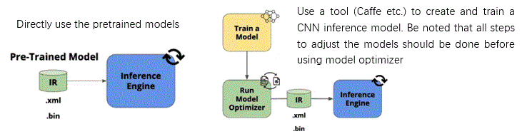

This document is the conclusion for Intel OpenVINO pretrained models, OpenVINO Open Model Zoo repository, and Intel IoT project reference webpage.  

Optimized models can expedite development and improve image processing pipelines.  
* [OpenVINO toolkit pretrained models](https://software.intel.com/en-us/openvino-toolkit/documentation/pretrained-models)  
* [Detailed info. for OpenVINO Pretrained Models](https://docs.openvinotoolkit.org/latest/_docs_resources_introduction.html)  
* [OpenVINO Toolkit Open Model Zoo repository](https://github.com/opencv/open_model_zoo)  
* [Intel IoT developer's tools, templates, libraries, DL project reference](https://devmesh.intel.com/topics/31)  
   
# OpenVINO toolkit pretrained models
> **IMAGE CLASSIFICATION**: A form of inference in which an object in an image is determined to be of a particular class, such as a cat vs. a dog.  

> **OBJECT DETECTION**: A form of inference in which objects within an image are detected, and a bounding box is output based on where in the image the object was detected. Usually, this is combined with some form of classification to also output which class the detected object belongs to.  

> **SEMANTIC SEGMENTATION**: A form of inference in which objects within an image are detected and classified on a pixel-by-pixel basis, with all objects of a given class given the same label.  
>> Semantic segmentation includes two steps:  
>> 1)	Location: frame objects by bounding box. bounding box usually contains 4 integer,-the topleft(x,y) and the bottom right(x,y); or the topleft(x,y) and the width, height  
>> 2)	Classification: classify the object in bounding box. CNN model scan the picture by kernel to extract the image feature, pooling the feature matrix and output for next layer process kernel, by this loop, the last full convolution layer will convert the feature matrix to probability.  

> **INSTANCE SEGMENTATION**: Similar to semantic segmentation, this form of inference is done on a pixel-by-pixel basis, but different objects of the same class are separately identified.  

## Tools  
* Use the Benchmark C++ Tool to estimate deep learning inference performance on supported devices. Performance can be measured for two inference modes: synchronous (latency-oriented) and asynchronous (throughput-oriented)  
* Accuracy Checker Tool - Measure accuracy  
* Calibration Tool - Calibrate model 
* Inference Engine Collect Statistics Tool collects statistics for a given model  
* downloader.py (model downloader) downloads model files from online sources and, if necessary, patches them to make them more usable with Model Optimizer  
*  converter.py (model converter) converts the models that are not in the Inference Engine IR format into that format using Model Optimizer  
* info_dumper.py (model information dumper) prints information about the models in a stable machine-readable format  

## Key examples
> Run the application with inference executed in the asynchronous mode  
>> * at start-up, application reads command line parameters and loads specified network and input images to the Inference Engine plugin. The batch size of the network is set according to the number of read images  
>> * then the app. creates an inference request object and assigns completion callback for it. In scope of the completion callback handling the inference request is executed again  
>> * After that, the app. starts inference for the first infer request and waits of 10th inference request execution being completed. When inference is done, the application outputs data to the standard output stream.  

> It is sure that we can run and stack different models synchronously or asynchronously  
> We can have multi-channel scenarios, such as face detection and human pose estimation  
> Involved deep learning networks: R-CNN,SSD,YOLOv3  
> AI city project https://github.com/incluit/OpenVino-For-SmartCity  
> Driver Behaviour https://github.com/incluit/OpenVino-Driver-Behaviour  

## Intel IoT webpage
https://devmesh.intel.com/topics/31  
