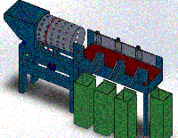
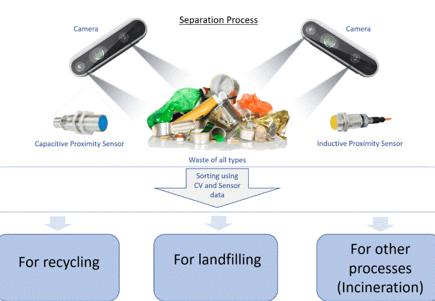

This document is the conclusion for Intel OpenVINO pretrained models, OpenVINO Open Model Zoo repository, and Intel IoT project reference webpage.  

Optimized models can expedite development and improve image processing pipelines.  
* [OpenVINO toolkit pretrained models](https://software.intel.com/en-us/openvino-toolkit/documentation/pretrained-models)  
* [Detailed info. for OpenVINO Pretrained Models](https://docs.openvinotoolkit.org/latest/_docs_resources_introduction.html)  
* [OpenVINO Toolkit Open Model Zoo repository](https://github.com/opencv/open_model_zoo)  
* [Intel IoT developer's tools, templates, libraries, DL project reference](https://devmesh.intel.com/topics/31)  
   
# OpenVINO toolkit pretrained models
> **IMAGE CLASSIFICATION**: A form of inference in which an object in an image is determined to be of a particular class, such as a cat vs. a dog.  

> **OBJECT DETECTION**: A form of inference in which objects within an image are detected, and a bounding box is output based on where in the image the object was detected. Usually, this is combined with some form of classification to also output which class the detected object belongs to.  

> **SEMANTIC SEGMENTATION**: A form of inference in which objects within an image are detected and classified on a pixel-by-pixel basis, with all objects of a given class given the same label.  
>> Semantic segmentation includes two steps:  
>> 1)	Location: frame objects by bounding box. bounding box usually contains 4 integer,-the topleft(x,y) and the bottom right(x,y); or the topleft(x,y) and the width, height  
>> 2)	Classification: classify the object in bounding box. CNN model scan the picture by kernel to extract the image feature, pooling the feature matrix and output for next layer process kernel, by this loop, the last full convolution layer will convert the feature matrix to probability.  

> **INSTANCE SEGMENTATION**: Similar to semantic segmentation, this form of inference is done on a pixel-by-pixel basis, but different objects of the same class are separately identified.  

## Tools  
* Use the Benchmark C++ Tool to estimate deep learning inference performance on supported devices. Performance can be measured for two inference modes: synchronous (latency-oriented) and asynchronous (throughput-oriented)  
* Accuracy Checker Tool - Measure accuracy  
* Calibration Tool - Calibrate model 
* Inference Engine Collect Statistics Tool collects statistics for a given model  
* downloader.py (model downloader) downloads model files from online sources and, if necessary, patches them to make them more usable with Model Optimizer  
*  converter.py (model converter) converts the models that are not in the Inference Engine IR format into that format using Model Optimizer  
* info_dumper.py (model information dumper) prints information about the models in a stable machine-readable format  

## Key examples
> Run the application with inference executed in the asynchronous mode  
>> * at start-up, application reads command line parameters and loads specified network and input images to the Inference Engine plugin. The batch size of the network is set according to the number of read images  
>> * then the app. creates an inference request object and assigns completion callback for it. In scope of the completion callback handling the inference request is executed again  
>> * After that, the app. starts inference for the first infer request and waits of 10th inference request execution being completed. When inference is done, the application outputs data to the standard output stream.  

> It is sure that we can run and stack different models synchronously or asynchronously  
> We can have multi-channel scenarios, such as face detection and human pose estimation  
> Involved deep learning networks: R-CNN,SSD,YOLOv3  
> AI city project https://github.com/incluit/OpenVino-For-SmartCity  
> Driver Behaviour https://github.com/incluit/OpenVino-Driver-Behaviour  

# Intel IoT webpage for brainstorming
https://devmesh.intel.com/topics/31  
## Smart City
* an engineering technique to track and monitor the various quality parameters of water (pH, dissolved oxygen, temperature, conductivity, etc.)  
* Garbage Sorting and Separation  
  
  
* CLEAN WATER AI IS AN IOT DEVICE THAT CONTINUOUSLY MONITORS WATER QUALITY AROUND WATER SOURCES
FOR DANGEROUS BACTERIAS AND HARMFUL PARTICLES: https://cleanwaterai.com/  
## Industry
* an equipment adaptive predictive maintenance system that keeps improving with operation time and reduces the diagnostic work: 6 Sigma DMAIC methodology  
## Healthcare
* Identification of Pathological Disease in Plants Using Intel Distribution of OpenVINO Toolkit  
* Using AI Streaming platform for fitness professionals, yoga teachers, dance instructors so they can host live class with live feedbacks: Using AI Streaming platform for fitness professionals, yoga teachers, dance instructors so they can host live class with live feedbacks    
* Using AI Streaming platform for fitness professionals, yoga teachers, dance instructors so they can host live class with live feedbacks  
* Acute Myeloid & Lymphoblastic Leukemia Detection System: https://github.com/AMLResearchProject/AML-ALL-Detection-System  
* Identifying Viral and Bacterial Pneumonia from Chest X-Ray Images using TensorFlow  
* dynamically conceive the motion of a user's hand and ascertain the difference between intentional movement and unintentional movement. Further we quantify, verify and attempt to provide haptic response to the users' fingers with the help of electroactive polymers to help counteract the unwanted vibration. (For the proof of concept, used Coin Motors)  
* SadiaX uses Intel distribution of OPENVINO and deep learning to detect the position of the patient and predict falls  
* TrueSight is the potential solution to providing assistance to the visually impaired in a world of complex ambient activities and interactions. It leverages the power of AI in Computer Vision to analyze real-time events and generate feedback in the form of audio to keep the user as aware as possible  
* ProBion consists of two main components, the interpreter which receives signals from neurons and the AI program interprets the signal and instruction sets in relation to these signals are sent to the second component which is the prosthetic limb or exoskeleton  
* Automated Doctor Machine. The machine has all the required input sensors inbuilt to check the condition of the patient and also provides a diagnosis report with medicines.And this machine can be installed easily anywhere and it can be easily accessed using patient's unique card. All the payment are done online after providing the medicines to the patients. After receiving the medicines, the patient's health report is updated to the health record in his cloud account. So when he meets the doctor in future, the doctor can easily get his up to date health record and the doctor can also use the webapp to update his health record  
* Invasive Ductal Carcinoma (IDC) Classification Using Computer Vision & IoT combines Computer Vision and the Internet of Things to provide researchers, doctors and students with a way to train a neural network with labelled breast cancer histology images to detect Invasive Ductal Carcinoma (IDC) in unseen/unlabelled images:  Inception V3 model https://github.com/iotJumpway/Intel-Examples/tree/master/Intel-Movidius/IDC-Classification  

