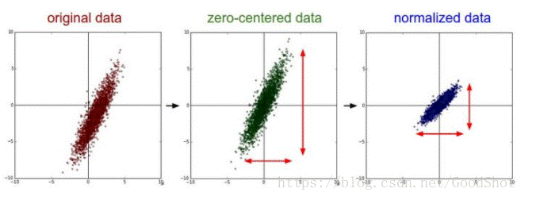
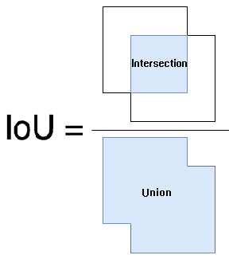
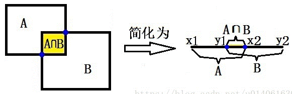
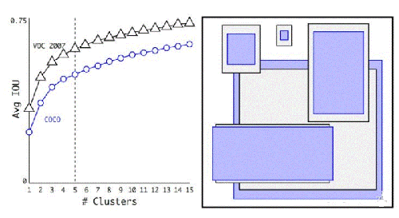
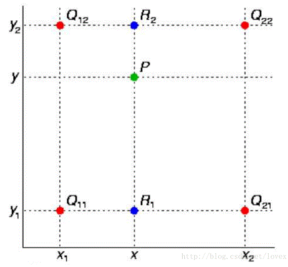
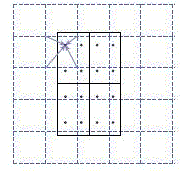
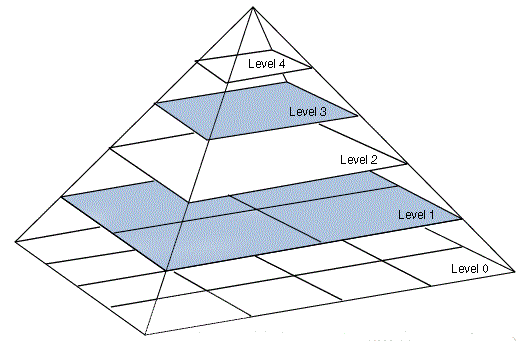
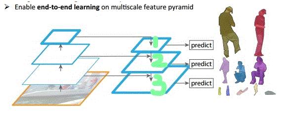
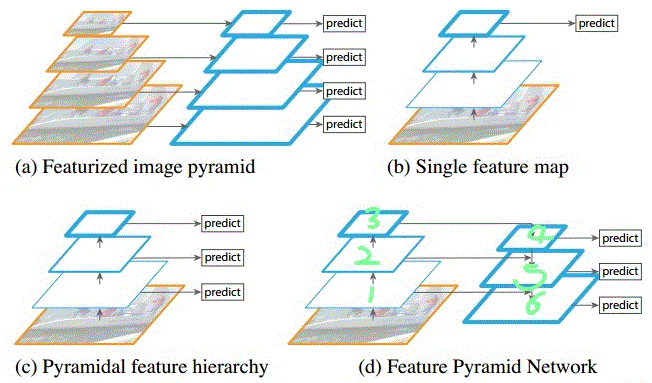

Mathematics theory and tools for YOLO framework  
---
# BOUNDING BOX
p 可能性，（bx, by, bh, bw）边框位置，（c1, c2, c3）目标分类;  
[p, bx, by, bh, bw, c1, c2, c3]
# MAP（平均精度均值）
mean Average Precision，mAP，模型训练就是提高mAP  
# ANCHOR（锚点）
Anchor Box（锚框）：锚点的提出使得候选框能够更加完整精确的框住不同类别的物体，对于最终检测精度的提升有着至关重要的作用。  
# 标准化-归一化
数据标准化（归一化，数值减去均值，再除以标准差）处理是数据挖掘的一项基础工作，不同评价指标往往具有不同的量纲和量纲单位，这样的情况会影响到数据分析的结果，为了消除指标之间的量纲影响，需要进行数据标准化处理，以解决数据指标之间的可比性。原始数据经过数据标准化处理后，各指标处于同一数量级，适合进行综合对比评价。  
通过中心化和标准化处理，得到均值为0，标准差为1的服从标准正态分布的数据。在训练神经网络的过程中，通过将数据标准化，能够加速权重参数的收敛。对数据进行中心化预处理，这样做的目的是要增加基向量的正交性。  
   
左图表示的是原始数据；中间的是中心化后的数据，数据被移动大原点周围；右图将中心化后的数据除以标准差，得到为标准化的数据，可以看出每个维度上的尺度是一致的（红色线段的长度表示尺度）  
# NMS（非极大值抑制）
图像目标检测的最初想法就是用一个框去从左到右从上到下（滑窗）扫描一张图片，这样的话就有可能有很多个点会声明（表示）自己发现了目标，只是p 可能性（或者IoU）有大有小，非极大值抑制就是把“不是最大可能性”的给抑制（“丢弃”），或者说保留可能性最大的。  
NMS方法并不复杂，其核心思想是：选择得分最高的作为输出，与该输出重叠的去掉，不断重复这一过程直到所有备选处理完。YOLO的NMS计算方法如下。  
网络输出的7*7*30的张量，在每一个网格中，对象 位于第j个bounding box的得分: *$Conf_j$$)代表着某个对象存在于第j个bounding box的可能性。每个网格有(20个对象的概率*2个bounding box的置信度)40个得分（候选对象）。49个网格共1960个得分。Andrew Ng建议每种对象分别进行NMS，那么每种对象有 1960/20=98 个得分。  
NMS步骤如下：  

> 设置一个Score的阈值，低于该阈值的候选对象排除掉（将该Score设为0）
> 遍历每一个对象类别
>> 遍历该对象的98个得分
>>> 找到Score最大的那个对象及其bounding box，添加到输出列表
>>> 对每个Score不为0的候选对象，计算其与上面2.1.1输出对象的bounding box的IOU
>>> 根据预先设置的IOU阈值，所有高于该阈值（重叠度较高）的候选对象排除掉（将Score设为0）
>>> 如果所有bounding box要么在输出列表中，要么Score=0，则该对象类别的NMS完成，返回步骤2处理下一种对象  

> 输出列表即为预测的对象  
# IOU原理
IoU 的全称为交并比（Intersection over Union），IoU 计算的是 “预测的边框” 和 “真实的边框” 的交集和并集的比值。= Value_intersection/Value_union  
  
开始计算之前，我们首先进行分析下交集和并集到底应该怎么计算：我们首先需要计算交集，然后并集通过两个边框的面积的和减去交集部分即为并集，因此 IoU 的计算的难点在于交集的计算。两个框交集的计算。两个框交集的计算的实质是两个集合交集的计算。  
   
通过简化，我们可以清晰地看到，交集计算的关键是交集上下界点（图中蓝点）的计算。我们假设集合 A 为[x1,x2], ，集合 B 为[y1,y2], 然后我们来求AB交集的上下界限。交集计算的逻辑：  
* 交集下界 z1=max(x1,y1)  
* 交集上界 z2=min(x2,y2)  
如果z2-z1 小于0，则说明集合 A 和集合 B 没有交集  
# KMEANS聚类
决定anchors的尺寸大小。为统计出更符合样本中对象尺寸的先验框，这样就可以减少网络微调先验框到实际位置的难度。YOLOv3的做法是对训练集中标注的边框进行聚类分析，以寻找尽可能匹配样本的边框尺寸。聚类算法最重要的是选择如何计算两个边框之间的“距离”，对于常用的欧式距离，大边框会产生更大的误差，但我们关心的是边框的IOU。所以，YOLO2在聚类时采用以下公式来计算两个边框之间的“距离” d(box,centroid)=1-IOU(box,centroid)      
centroid是聚类时被选作中心的边框，box就是其它边框，d就是两者间的“距离”。IOU越大，“距离”越近。YOLO2给出的聚类分析结果如下图所示：  
 
上图左边是选择不同的聚类k值情况下，得到的k个centroid边框，计算样本中标注的边框与各centroid的Avg IOU。显然，边框数k越多，Avg IOU越大。YOLO2选择k=5作为边框数量与IOU的折中。对比手工选择的先验框，使用5个聚类框即可达到61 Avg IOU，相当于9个手工设置的先验框60.9 Avg IOU。  
# 高斯模糊
高斯模糊(也称为高斯平滑)是一种预处理技术，用于平滑图像的边缘以减少噪声。我们反直觉地采取这个步骤来减少我们检测到的行数，因为我们只想关注最重要的线条(车道线)，而不是每个对象上的条。我们必须小心，不要把图像弄得太模糊，否则很难画出一条线条来。  
# CANNY边缘检测
现在已经对图像进行了充分的预处理，我们可以应用Canny边缘检测器，它的作用是识别图像中的边缘并剔除所有其他数据。最终得到的图像是线条型的，这使我们更关注于车道检测，因为我们关注的是线条。  
# 霍夫变换
应用霍夫变换技术提取线条并给它们上色。霍夫变换的目标是通过识别所有的点来找到线。这是通过将我们当前用轴(x,y)表示的系统转换成轴为(m, b)的参数系统来实现的。直线被表示为点，点被表示为线，相交的线意味着同一点在多条线上。因此，在这样的平面中，我们可以更容易地识别出经过同一点的直线。然而，我们需要从当前的系统移动到使用极坐标系统的霍夫空间，因为当m=0(即垂直线)时，我们的原始表达式是不可微的。  
所有直线将通过一个给定的点对应于一个正弦曲线(ρ和θ)。因此,一组点相同的直线在笛卡尔空间将产生正弦曲线交叉的点(ρ和θ)。这自然意味着在笛卡尔空间的直线上探测点的问题被简化为在霍夫空间中寻找交叉的正弦信号。  
# ML中的MLE、MAP、贝叶斯估计
对于一个基础模型，通常都可以从MLE(极大似然估计)、MAP(最大后验估计)以及贝叶斯估计(Bayesian)去建模，比如对于逻辑回归（Logistics Regression）来说：  
* MLE: Logistics Regression  
* MAP: Regularized Logistics Regression  
* Bayesian: Bayesian Logistic Regression  
一旦选择了一个算法，就相当于我们选择了一个假设空间。在一个假设空间里，我们通常会有无数种不同的解（或者可以理解成模型），一个优化算法（比如梯度下降法）做的事情就是从中选择最好的一个解或者多个解/模型，当然优化过程要依赖于样本数据。举个例子，如果我们选择用支持向量机，那相当于我们可选的解/模型集中在上半部分（蓝色点）。  
* 每一个模型定义了一个假设空间，一般假设空间都包含无穷的可行解；  
* MLE不考虑先验（prior)，MAP和贝叶斯估计则考虑先验（prior）；  
* MLE、MAP是选择相对最好的一个模型（point estimation）， 贝叶斯方法则是通过观测数据来估计后验分布(posterior distribution)，并通过后验分布做群体决策，所以后者的目标并不是在去选择某一个最好的模型；  
* 当样本个数无穷多的时候，我们观测到的数据越来越多的时候，我们从数据中获取的信息的置信度是越高，MAP理论上会逼近MLE；  
* 贝叶斯估计复杂度大，通常用MC等近似算法来近似 

# 梯度插值和线性外推
要从屏幕底部跟踪到感兴趣区域的最高点，我们必须能够插入霍夫变换函数返回的不同点，并找到一条使这些点之间的距离最小化的线。基本上这是一个线性回归问题。我们将尝试通过最小化最小二乘误差来找到给定车道上的直线。我们方便地使用scipy.stats. linregress(x,y)函数的作用是:求车道线的斜率和截距。
构建WORDTREE  
* 检查每一个将用于训练和测试的ImageNet和COCO对象，在WordNet中找到对应的节点，如果该节点到WordTree根节点（physical object）的路径只有一条（大部分对象都只有一条路径），就将该路径添加到WrodTree    
* 经过上面操作后，剩下的是存在多条路径的对象。对每个对象，检查其额外路径长度（将其添加到已有的WordTree中所需的路径长度），选择最短的路径添加到WordTree。这样就构造好了整个WordTree    
对象互斥的情况下，用一个n维向量（n是预测对象的类别数）就可以表达一个对象（预测对象的那一维数值接近1，其它维数值接近0）。现在变成WordTree，合理的向量应该能够体现对象之间的蕴含关系。比如一个样本图像，其标签是是"dog"，那么显然dog节点的概率应该是1，然后，dog属于mammal，自然mammal的概率也是1，......一直沿路径向上到根节点physical object，所有经过的节点其概率都是1。所以，一个WordTree对应且仅对应一个对象，不过该对象节点到根节点的所有节点概率都是1，体现出对象之间的蕴含关系，而其它节点概率是0。那么用于预测时，如何根据WordTree各节点的概率值来确定其对应的对象呢？根据训练标签的设置，其实模型学习的是各节点的条件概率。假设一个样本标签是dog，那么dog=1，父节点mammal=1，同级节点cat=0，即P(dog|mammal)=1，P(cat|mammal)=0。
既然各节点预测的是条件概率，那么一个节点的绝对概率就是它到根节点路径上所有条件概率的乘积。比如  
P(Norfolk terrier) = P(Norfolk terrier|terrier) * P(terrier|hunting dog) * P(hunting dog|dog) *......* P(animal|physical object) * P(physical object)  
对于分类的计算，P(physical object) = 1。不过，为了计算简便，实际中并不计算出所有节点的绝对概率。而是采用一种比较贪婪的算法。从根节点开始向下遍历，对每一个节点，在它的所有子节点中，选择概率最大的那个（一个节点下面的所有子节点是互斥的），一直向下遍历直到某个节点的子节点概率低于设定的阈值（意味着很难确定它的下一层对象到底是哪个），或达到叶子节点，那么该节点就是该WordTree对应的对象。  
# 双线性插值
在数学上，双线性插值是有两个变量的插值函数的线性插值扩展，其核心思想是在两个方向分别进行一次线性插值。假设源图像大小为mxn，目标图像为axb。那么两幅图像的边长比分别为：m/a和n/b。注意，通常这个比例不是整数，编程存储的时候要用浮点型。目标图像的第（i,j）个像素点（i行j列）可以通过边长比对应回源图像。其对应坐标为（i*m/a,j*n/b）。显然，这个对应坐标一般来说不是整数，而非整数的坐标是无法在图像这种离散数据上使用的。双线性插值通过寻找距离这个对应坐标最近的四个像素点，来计算该点的值（灰度值或者RGB值）。如果你的对应坐标是（2.5,4.5），那么最近的四个像素是（2，4）、（2，5）、（3，4），（3，5）。若图像为灰度图像，那么（i，j）点的灰度值可以通过一下公式计算：  
f(i,j)=w1*p1+w2*p2+w3*p3+w4*p4; 其中，pi(i=1,2,3,4)为最近的四个像素点，wi(i=1,2,3,4)为各点相应权值。关于权值的计算，可参考维基百科。  
  
假如我们想得到未知函数 f 在点 P = (x, y) 的值，假设我们已知函数 f 在 Q11 = (x1, y1)、Q12 = (x1, y2), Q21 = (x2, y1) 以及 Q22 = (x2, y2) 四个点的值。最常见的情况，f就是一个像素点的像素值。首先在 x 方向进行线性插值，得到    
* \approx{\frac{x_2-x}{x_2-x_1}\left}f(Q_11)\right+{\frac{x-x_1}{x_2-x_1}\left}f(Q_21)\right$) where R_1=(x,y_1)    
* \approx{\frac{x_2-x}{x_2-x_1}\left}f(Q_12)\right+{\frac{x-x_1}{x_2-x_1}\left}f(Q_22)\right$) where R_2=(x,y_2)       
然后在 y 方向进行线性插值，得到    
* \approx{\frac{y_2-y}{y_2-y_1}\left}f(R_1)\right+{\frac{y-y_1}{y_2-y_1}\left}f(R_2)\right$)       
综合起来就是双线性插值最后的结果    
* \approx{\frac{f(Q_11)}{(x_2-x_1)(y_2-y_1)}\left}(x_2-x)(y_2-y)\right+{\frac{f(Q_21)}\left}(x-x_1)(y_2-y)\right+{\frac{f(Q_12)}{(x_2-x_1)(y_2-y_1)}\left}(x_2-x)(y-y_1)\right+{\frac{f(Q_22)}{(x_2-x_1)(y_2-y_1)}\left}(x-x_x1)(y-y_1)\right$)     
由于图像双线性插值只会用相邻的4个点，因此上述公式的分母都是1  
# ROI POOLING
roi是在原图中的感兴趣区域，可以理解为目标检测的候选框也就是region of proposals，我们将原图进行特征提取的时候，就会提取到相应的feature map。那么相应的ROI就会在feature map上有映射，这个映射过程就是roi pooling的一部分，一般ROI的步骤会继续进行max pooling，进而得到我们需要的feature map，送入后面继续计算。根据ROIS提供的候选框坐标，映射到FeatureMap，然后进行max-pooling，和普通的max-pooling的不同之处在于池化窗口的内部的各自包含的特征值数量不一样。    
* 在原图上生成的region proposal 映射到feature map需要除以16或者32的时候，边界出现小数，这是第一次量化    
* 在每个roi里划分成k×k(7×7)的bins，对每个bin中均匀选取多少个采样点，然后进行max pooling，也会出现小数，这是第二次量化    
ROI Align并不需要对两步量化中产生的浮点数坐标的像素值都进行计算，而是设计了一套优雅的流程。如下图，其中虚线代表的是一个feature map，实线代表的是一个roi(在这个例子中，一个roi是分成了2*2个bins)，实心点代表的是采样点，每个bin中有4个采样点。我们通过双线性插值的方法根据采样点周围的四个点计算每一个采样点的值，然后对着四个采样点执行最大池化操作得到当前bin的像素值。  
  
RoI Align做法：假定采样点数为4，即表示，对于每个2.97 x 2.97的bin，平分四份小矩形，每一份取其中心点位置，而中心点位置的像素，采用双线性插值法进行计算，这样就会得到四个小数坐标点的像素值。  
# RPN
Region Proposal Network，RPN是在Faster RCNN结构中首先被应用专门用来提取候选框，在RCNN和Fast RCNN等物体检测架构中，用来提取候选框的方法通常是Selective Search，是比较传统的方法，而且比较耗时，在CPU上要2s一张图。所以作者提出RPN，专门用来提取候选框，一方面RPN耗时少，另一方面RPN可以很容易结合到Fast RCNN中，称为一个整体。RPN的引入，可以说是真正意义上把物体检测整个流程融入到一个神经网络中，这个网络结构叫做Faster RCNN； Faster RCNN = RPN + Fast RCNN。  
RPN一般插入在最后一个卷积层和全连接层之间，卷积层结束后得到一个特征图，使用一个窗口在特征图上滑动。每次窗口都能得到一个框内是否是目标的分数（概率），同时对于边框的顶点位置进行回归。RPN首次提出了锚点（Anchor）的概念，即对于每个滑动窗口，使用 n 个尺度因子和 m 个不同长宽比共计 m×n 个不同的区域候选框。  
# FPN架构
    
如图是一个图像金字塔，在很多的经典算法里面都有它，比如SIFT、HOG等算法。我们常用的是高斯金字塔，所谓的高斯金字塔是通过高斯平滑和亚采样获得一些下采样图像，也就是说第K层高斯金字塔通过平滑、亚采样操作就可以获得K+1层高斯图像，高斯金字塔包含了一系列低通滤波器，其截止频率从上一层到下一层是以因子2逐渐增加，所以高斯金字塔可以跨越很大的频率范围。我们输入一张图片，可以获得多张不同尺度的图像，我们将这些不同尺度的图像的4个顶点连接起来，就可以构造出一个类似真实金字塔的一个图像金字塔。通过这个操作，我们可以为2维图像增加一个尺度维度（或者说是深度），这样我们可以从中获得更多的有用信息。整个过程类似于人眼看一个目标由远及近的过程（近大远小原理）。  
  

特征金字塔可以在速度和准确率之间进行权衡，可以通过它获得更加鲁棒的语义信息。图像中存在不同尺寸的目标，而不同的目标具有不同的特征，利用浅层的特征就可以将简单的目标的区分开来；利用深层的特征可以将复杂的目标区分开来；在第1层（绿色标注）输出较大目标的实例分割结果，在第2层输出次大目标的实例检测结果，在第3层输出较小目标的实例分割结果。检测也是一样，我们会在第1层输出简单的目标，第2层输出较复杂的目标，第3层输出复杂的目标。  
   
* 识别不同大小的物体是计算机视觉中的一个基本挑战，我们常用的解决方案是构造多尺度金字塔。整个过程是先对原始图像构造图像金字塔，然后在图像金字塔的每一层提出不同的特征，然后进行相应的预测，这种方法的优点是可以获得较好的检测精度；缺点是计算量大，需要大量的内存，通常会成为整个算法的性能瓶颈，由于这些原因，当前很少使用这种算法。  
* 一种改进的思路b发现可以利用卷积网络本身的特性，即对原始图像进行卷积和池化操作，通过这种操作我们可以获得不同尺寸的feature map，这样其实就类似于在图像的特征空间中构造金字塔。实验表明，浅层的网络更关注于细节信息，高层的网络更关注于语义信息，而高层的语义信息能够帮助我们准确的检测出目标，因此我们可以利用最后一个卷积层上的feature map来进行预测。这种方法存在于大多数深度网络中，比如VGG、ResNet、Inception，它们都是利用深度网络的最后一层特征来进行分类。这种方法的优点是速度快、需要内存少。它的缺点是我们仅仅关注深层网络中最后一层的特征，却忽略了其它层的特征，但是细节信息可以在一定程度上提升检测的精度。  
* 图c所示的架构，它的设计思想就是同时利用低层特征和高层特征，分别在不同的层同时进行预测，这是因为我的一幅图像中可能具有多个不同大小的目标，区分不同的目标可能需要不同的特征，对于简单的目标我们仅仅需要浅层的特征就可以检测到它，对于复杂的目标我们就需要利用复杂的特征来检测它。整个过程就是首先在原始图像上面进行深度卷积，然后分别在不同的特征层上面进行预测。它的优点是在不同的层上面输出对应的目标，不需要经过所有的层才输出对应的目标（即对于有些目标来说，不需要进行多余的前向操作），这样可以在一定程度上对网络进行加速操作，同时可以提高算法的检测性能。它的缺点是获得的特征不鲁棒，都是一些弱特征（因为很多的特征都是从较浅的层获得的）。  
* FPN的架构如图d所示，整个过程如下所示，首先我们在输入的图像上进行深度卷积，然后对Layer2上面的特征进行降维操作（即添加一层1x1的卷积层），对Layer4上面的特征进行上采样操作，使得它们具有相应的尺寸，然后对处理后的Layer2和处理后的Layer4执行加法操作（对应元素相加），将获得的结果输入到Layer5中去。其背后的思路是为了获得一个强语义信息，这样可以提高检测性能。FPN使用了更深的层来构造特征金字塔是为了使用更加鲁棒的信息；除此之外，将处理过的低层特征和处理过的高层特征进行累加，目的是因为低层特征可以提供更加准确的位置信息，而多次的降采样和上采样操作使得深层网络的定位信息存在误差，因此将其结合其起来使用，这样就构建了一个更深的特征金字塔，融合了多层特征信息，并在不同的特征进行输出。  

# 模型结构查看工具
https://lutzroeder.github.io/netron/ 比如从Yolo的官网上下载yolov3的权重文件，然后通过官网上的指导转化为H5文件，然后可以再这个浏览器工具里直接看yolov3的每一层是如何分布的
